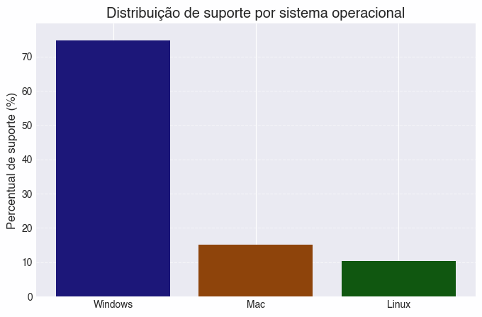
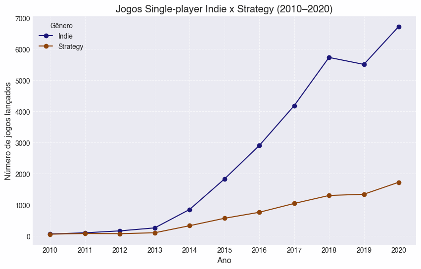

# Steam Games — Catalogue Analysis

Analysis of ~73,000 games published on Steam, built in two parts: a small object-oriented Python package that answers questions with the standard library only, and a pandas notebook that explores the catalogue and charts the findings.

## Overview

The project deliberately solves the same kind of problem twice, with different tools:

1. **`src/steam_analysis`** — a package with no third-party dependencies. `Games` models a title, `parse_games` turns raw CSV rows into objects, and `CalculateQuestions` aggregates over them (free vs. paid share, busiest release year, most common genre). Every public function carries doctest-style examples.
2. **`notebooks/01_exploratory_analysis.ipynb`** — the same dataset through pandas: cleaning, missing-value audit, ranking, grouping and Matplotlib charts.

## Tech stack

`Python` · `pandas` · `NumPy` · `Matplotlib` · `csv` · `pytest` · OOP · Jupyter

## Results

- **72,934 games** analysed across 20 columns; missing data concentrated in `Movies` (7.1%), `Categories` (4.8%), `Publishers` (3.9%) and `Genres` (3.5%).
- **Platform support:** Windows 74.6%, macOS 15.1%, Linux 10.3%. Linux support **grew from 1,187 titles in 2018 to 1,311 in 2022**, with a dip in 2019 (922).
- **Indie dominates and accelerates:** single-player Indie releases went from 66 (2010) to 6,724 (2020) — a 100× increase, while Strategy grew 29× over the same window.
- **Top Metacritic scores:** Disco Elysium – The Final Cut and Persona 5 Royal (97), followed by Half-Life and Half-Life 2 (96).
- **Role-playing games** average 0.95 DLCs and 1,516 positive reviews, with maxima of 2,366 DLCs and 964,983 positive reviews — a long-tailed distribution.
- **Most prolific paid publishers:** Big Fish Games (443 titles), 8floor (239), Strategy First (162) — but Strategy First has by far the highest mean review count (276 vs. a median of 23), meaning a handful of hits carry the catalogue.

## Visuals

| OS support share | Indie vs. Strategy releases |
|---|---|
|  |  |

## How to run

```bash
python -m venv .venv
source .venv/bin/activate
pip install -e .
```

Answer the questions with the pure-Python package:

```bash
python scripts/answer_questions.py
```

Run the tests:

```bash
pytest
```

Open the exploratory notebook:

```bash
jupyter lab notebooks/01_exploratory_analysis.ipynb
```

## Data

The full dataset (`steam_games.csv`, ~72k rows) is **not versioned here** because of its size. Download it from the [Steam Games Dataset on Kaggle](https://www.kaggle.com/datasets/fronkongames/steam-games-dataset) and save it as `data/raw/steam_games.csv`.

A 20-row sample is committed at `data/sample/steam_games_sample.csv` so the test suite runs without the full download. `scripts/make_sample.py` regenerates it.

## Project structure

```
├── src/steam_analysis
│   ├── class_game.py           # Games model
│   ├── load_csv.py             # CSV reader (stdlib only)
│   ├── insert_df_class.py      # rows -> Games objects
│   └── calculate_questions.py  # aggregations over the collection
├── scripts
│   ├── answer_questions.py     # runs the package end to end
│   └── make_sample.py          # regenerates the committed sample
├── notebooks/01_exploratory_analysis.ipynb
├── tests/test_pipeline.py
└── reports/figures
```

> Analysis and comments inside the notebook are written in Brazilian Portuguese.
